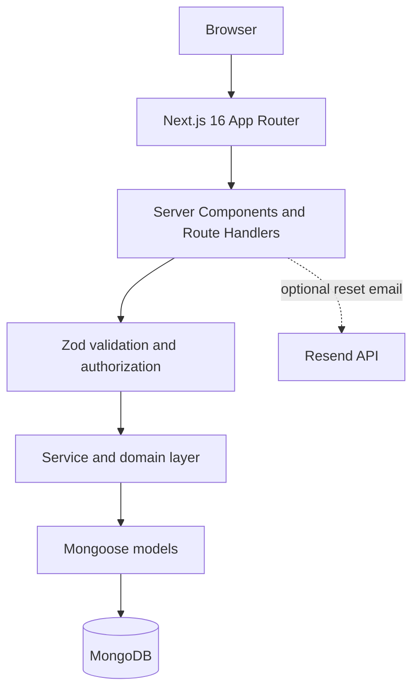

# NV Bookstore

A modern full-stack bookstore with secure authentication, catalogue search, a persistent cart, demo checkout, order history, and protected inventory administration.

[Live deployment](https://nv-bookstore.vercel.app/) · [Repository](https://github.com/NandanVyas/bookstore)

> The public URL shows the last revision deployed to Vercel. Deploy this V2 revision and configure the variables below before evaluating its database-backed flows.


## Overview

NV Bookstore is a deliberately compact modular monolith. Public catalogue pages are server-rendered, interactive surfaces stay focused client components, App Router route handlers validate their inputs, services own domain rules, and Mongoose models persist the resulting state in MongoDB.

Originally built as an early full-stack project, NV Bookstore was re-engineered in 2026 to modernize the architecture, security, UX, testing, and delivery workflow. The modernization is part of the project story: the V2 codebase replaces the original Pages Router, JavaScript, reversible password encryption, browser-stored JWT, duplicated catalogue routes, and template UI with current production-oriented patterns.

## Features

- Searchable `/books` catalogue with URL-based category, price, availability, and sort filters
- Dynamic book pages with metadata, stock state, resilient cover fallbacks, and related titles
- Guest cart in local storage, authenticated MongoDB cart, and cart merge after sign-in
- Clear cart, shipping, order-review, demo-payment, confirmation, and order-history flow
- Registration, login, logout, password reset, profile editing, and session invalidation
- Protected admin dashboard for book CRUD, stock control, archiving, and order status updates
- Loading, error, no-results, empty-cart, and no-orders states
- Responsive editorial design with keyboard focus styles and reduced-motion support
- Seed data, health route, structured server logging, Docker workflow, tests, and CI

## Architecture



Authentication is a seven-day, signed HTTP-only cookie. The session contains only the user ID, role, and session version; protected operations resolve the current database user again before enforcing role or ownership rules. Password changes, resets, and admin promotion increment the session version so existing sessions become invalid.

Checkout is intentionally a demo flow:

```text
Cart → Shipping validation → Server-side stock check
     → Order and price snapshots → Demo payment reference → Order history
```

No payment-card or Paytm credentials are collected.

## Tech stack

- Next.js 16.3.1 App Router and React 19.2.8
- TypeScript 5.9 with strict checking
- MongoDB 8 and Mongoose 9
- Zod 4 request/domain validation
- Argon2id password hashing and JOSE-signed sessions
- Project design system in plain modern CSS
- Vitest 4 and Playwright 1.58
- ESLint 9 flat configuration
- Multi-stage Docker image and GitHub Actions

## Security

- Passwords are one-way Argon2id hashes and excluded from normal queries.
- The legacy AES password field is retained only as a non-selected migration marker; it is never decrypted. A reset replaces it with an Argon2id hash and removes the old field.
- Session cookies are HTTP-only, `SameSite=Lax`, path-scoped to `/`, time-limited, and `Secure` in production.
- Request bodies and route parameters are validated with Zod.
- State-changing browser requests receive same-origin checks; auth endpoints also have conservative in-process rate limits.
- Catalogue writes, admin reads, and order status changes require a database-confirmed admin role.
- Order reads enforce owner-or-admin access; clients cannot submit prices or totals.
- Reset tokens are random, stored only as SHA-256 digests, expire after 30 minutes, and are single-use.
- API failures return safe error envelopes; password hashes, reset tokens, stack traces, and secrets are not logged or returned.
- `.env.local` is no longer tracked. Treat every value previously committed to repository history as compromised and rotate it.

The included rate limiter is best-effort per application process. A distributed deployment should replace it with a shared backing store or edge/provider rate limiting.

## Local development

Requirements: Node.js 20.9 or newer, npm, and MongoDB.

```bash
git clone https://github.com/NandanVyas/bookstore.git
cd bookstore
npm install
cp .env.example .env.local
npm run db:seed -- --reset
npm run dev
```

On Windows PowerShell, use `Copy-Item .env.example .env.local` instead of `cp`.

Create an administrator after registering the target account:

```bash
npm run admin:promote -- --email=you@example.com
```

For a containerized local stack, set `AUTH_SECRET` in your shell or a local untracked environment file, then run:

```bash
docker compose up --build
```

## Environment variables

| Variable | Required | Purpose |
| --- | --- | --- |
| `MONGODB_URI` | Yes | Application MongoDB connection string |
| `AUTH_SECRET` | Yes | Random session-signing secret, at least 32 characters |
| `NEXT_PUBLIC_APP_URL` | Yes in deployment | Canonical public origin, for example `https://nv-bookstore.vercel.app` |
| `RESEND_API_KEY` | Password reset only | Server-side Resend credential |
| `EMAIL_FROM` | Password reset only | Verified sender address |
| `TEST_MONGODB_URI` | Integration tests only | Disposable MongoDB database used by Vitest |

Generate `AUTH_SECRET` with a cryptographically secure secret manager or platform command. Never commit populated environment files.

## Quality checks

```bash
npm run type-check
npm run lint
npm test
npm run build
```

Mongo-backed integration tests run when `TEST_MONGODB_URI` is present. The critical Playwright journey needs a seeded database and validates browse → cart → register/logout/login → demo checkout → order history:

```bash
npm run db:seed -- --reset
npm run test:e2e
```

## CI/CD

`.github/workflows/ci.yml` runs install, strict type checking, zero-warning lint, unit/integration tests, and an optimized build on pull requests and pushes to `master`. A second job starts MongoDB, seeds the catalogue, installs Chromium, and runs the Playwright journey.

Vercel remains the deployment platform. The workflow deliberately validates the revision without duplicating Vercel deployment or storing deployment credentials in GitHub.

## Design decisions

- **Modular monolith:** appropriate boundaries without operationally expensive microservices.
- **Server-first rendering:** public content is rendered on the server; JavaScript is reserved for cart, forms, navigation, and admin interactions.
- **Demo payment instead of Paytm:** the old unverified payment callback was removed. The app states clearly that no real purchase occurs.
- **CSS cover fallback:** seed data uses stable, branded cover compositions rather than hotlinked random images; external cover URLs still use `next/image` when an administrator supplies one.
- **Archive rather than hard-delete:** admin removal makes a book inactive so historical order snapshots remain credible.
- **Order snapshots:** title, author, slug, cover URL, and purchase-time price are stored with each order.

## Known limitations

- Payments and fulfillment are simulated; no real charge, refund, shipment, or tracking exists.
- Password-reset delivery requires Resend configuration. The endpoint remains deliberately generic when email is unavailable.
- Legacy AES-only accounts cannot sign in with their old password because the application never decrypts it. They must use password reset or re-register.
- The local rate limiter is not shared between serverless instances.
- Stock updates use guarded atomic decrements plus compensating rollback. A replica-set deployment could use a MongoDB transaction for stronger multi-item atomicity.
- The repository does not include production user data or deployment secrets.

## Suggested portfolio captures

Capture these after seeding and deploying V2 at 1440px desktop and 390px mobile:

1. Homepage hero and featured books
2. Filtered catalogue with URL state visible
3. Book detail and cart drawer
4. Checkout review with the demo-store notice
5. Order history/detail
6. Admin inventory and order-status dashboard

## License and project status

This repository is a portfolio project maintained by [Nandan Vyas](https://github.com/NandanVyas). Use the issue tracker for reproducible bugs or scoped enhancement proposals; never include credentials or personal data in an issue.
